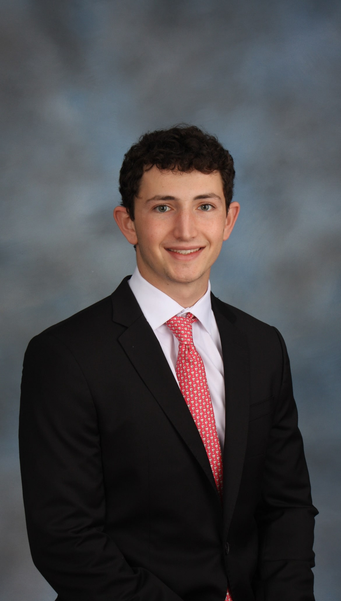

---

title: "About Sam Kassan"

---

## Education

Sam is currently in his third year at Vanderbilt University, where he is pursuing a degree in Biomedical Engineering with a minor in Digital Fabrication.

## Experiences

* **VP, Vanderbilt Neurotech** – Leading the development of a **BCI-controlled assistive feeding arm.**
* **Research Intern, NYU Musculoskeletal Research Center (May–Aug 2025)** – Studied the effects of a **hyaluronan-binding peptide on inflammation**, performing RNA extraction, cDNA synthesis, and qPCR analysis to assess macrophage polarization.
* **Research Intern, NYU Langone South Shore Neurologic Associates (June–Aug 2024)** – Organized electronic medical records and analyzed data on **Alzheimer’s and Parkinson’s disease treatments**, contributing to publications on patient outcomes and disease progression. 

## Technical Skills

Sam can operate a number of different tools to turn 3D models into real-life parts. Sam has experience with the following technologies:

* Fusion 360 (CAD 3D modeling)
* Fused Filament Fabrication (FFF)
* Stereolithography (SLA)
* Laser Cutting

<!--  -->

