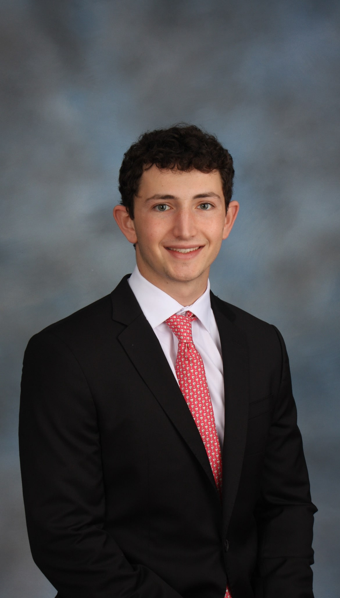

---

title: "About Sam Kassan"

---

## Education

Sam is currently a senior at Vanderbilt University, where he is pursuing a degree in Biomedical Engineering with a minor in Digital Fabrication.

## Experiences

* **Engineering Design Intern, 3D Design and Innovation Lab at Northwell Health (June 2026-August 2026)** - Led the design and prototyping of various medical devices in collaboration with doctors at the North Shore University Hospital.
* **VP, Vanderbilt Neurotech (Nov 2024-Nov 2025)** – Led the mechanical design team and administrative efforts for the development of an EEG-controlled assistive feeding robotic arm.
* **Research Intern, NYU Musculoskeletal Research Center (May–Aug 2025)** – Studied the effects of a hyaluronan-binding peptide on inflammation, performing RNA extraction, cDNA synthesis, and qPCR analysis to assess macrophage polarization.
* **Research Intern, NYU Langone South Shore Neurologic Associates (June–Aug 2024)** – Organized electronic medical records and analyzed data on Alzheimer’s and Parkinson’s disease treatments, contributing to publications on patient outcomes and disease progression. 

## Technical Skills

Sam has a diverse technical foundation spanning engineering design, digital fabrication, and computational analysis. He has experience with the following technologies:

* Fusion 360 (CAD 3D modeling)
* Fused Filament Fabrication (FFF)
* Stereolithography (SLA)
* Selective Laser Sintering
* Laser Cutting
* Generative Design
* MATLAB

<!--  -->

